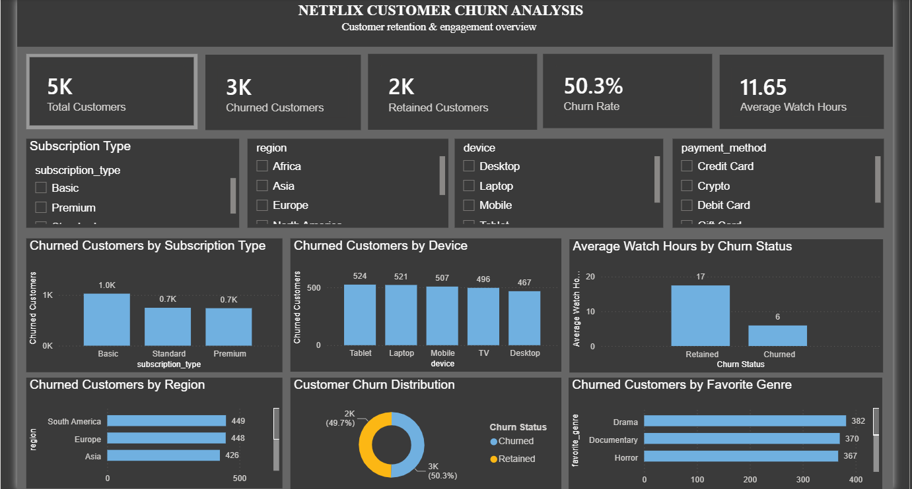

# SWYNEX Data Analytics Internship

## Netflix Customer Churn Analysis

This repository contains the data analytics projects completed during my **Data Analyst Internship at SWYNEX Technologies**.

The project focuses on analyzing Netflix-style customer data to understand customer churn, identify high-risk customer segments, and generate data-driven business insights.

---

## Project Objective

The main objective of this project is to analyze customer churn patterns and understand the factors associated with customer retention and churn.

The project covers the complete data analytics workflow:

**Data Cleaning → Exploratory Data Analysis → Visualization → SQL Analysis → Interactive Dashboard → Business Insights**

---

## Dataset

The project uses a Netflix customer churn dataset containing customer-level information.

### Dataset Details

- **Records:** 5,000 customers
- **Features:** 15
- **Target Variable:** `churned`
- `1` = Churned
- `0` = Retained

### Main Features

- Customer ID
- Age
- Gender
- Subscription Type
- Watch Hours
- Last Login Days
- Region
- Device
- Monthly Fee
- Payment Method
- Number of Profiles
- Average Watch Time per Day
- Favorite Genre
- Churn Status

---

# Internship Tasks

## Task 1 — Data Cleaning & Preparation

The dataset was inspected and prepared for analysis.

### Activities

- Checked dataset structure
- Examined data types
- Identified missing values
- Checked duplicate records
- Validated numerical and categorical values
- Prepared the cleaned dataset

### Tools

- Python
- Pandas
- NumPy
- Jupyter Notebook

---

## Task 2 — Exploratory Data Analysis

Exploratory analysis was performed to understand customer behavior and identify churn patterns.

### Analysis Areas

- Churn distribution
- Subscription type
- Customer demographics
- Viewing behavior
- Regional patterns
- Device usage
- Payment methods
- Customer engagement

### Tools

- Python
- Pandas
- Matplotlib
- Seaborn
- Jupyter Notebook

---

## Task 3 — Interactive Dashboard

An interactive Power BI dashboard was created to provide a visual overview of customer churn.

### Dashboard Components

- Total Customers
- Churned Customers
- Retained Customers
- Churn Rate
- Average Watch Hours
- Customer Churn Distribution
- Churn by Subscription Type
- Churn by Region
- Churn by Device
- Interactive Slicers

### Tool

**Power BI**

Dashboard screenshot:



---

## Task 4 — Final Data Analytics Project

The final project integrates the previous tasks into a complete business-focused analysis.

### Workflow

1. Define the business problem
2. Load the cleaned dataset
3. Validate data quality
4. Analyze overall churn
5. Analyze churn by subscription
6. Analyze churn by region
7. Analyze churn by device
8. Analyze churn by payment method
9. Analyze customer engagement
10. Integrate Power BI dashboard
11. Identify business insights
12. Provide recommendations

### Final Analysis

The complete analysis is available in:

`task_4_final_project/final_analysis.ipynb`

Business insights and recommendations are available in:

`task_4_final_project/business_insights.md`

---

# Key Business Insights

### Basic Subscription

Basic subscribers showed the highest observed churn rate:

**61.83%**

compared with:

- Standard: 45.44%
- Premium: 43.71%

### Payment Method

The highest observed churn rates were:

- Crypto: 59.70%
- Gift Card: 57.79%

### Customer Engagement

Average watch hours:

| Customer Status | Average Watch Hours |
|---|---:|
| Retained | 17.45 |
| Churned | 5.92 |

### Login Activity

Average days since last login:

| Customer Status | Average Days |
|---|---:|
| Retained | 21.77 |
| Churned | 38.31 |

### Overall Churn

- Total Customers: **5,000**
- Churned Customers: **2,515**
- Retained Customers: **2,485**
- Overall Churn Rate: **50.30%**

These findings represent associations observed in the dataset and do not establish direct causation.

---

# Recommendations

Based on the analysis:

1. Prioritize retention strategies for Basic subscribers.
2. Monitor high-churn payment segments.
3. Identify customers showing declining viewing activity.
4. Monitor increasing inactivity and login gaps.
5. Improve customer engagement through personalized content recommendations.
6. Use the Power BI dashboard for continuous churn monitoring.
7. Apply customer segmentation to develop targeted retention strategies.

---

# Technologies Used

- Python
- Pandas
- NumPy
- Matplotlib
- Seaborn
- Power BI
- Jupyter Notebook
- SQL
- Git
- GitHub

---

# Repository Structure

```text
SWYNEX-Data-Cleaning-Preparation/
│
├── README.md
│
├── data/
│   ├── raw/
│   │   └── netflix_customer_churn.csv
│   │
│   └── processed/
│       └── netflix_customer_churn_cleaned.csv
│
├── notebook/
│   ├── task1_data_cleaning.ipynb
│   └── task2_exploratory_data_analysis.ipynb
│
├── task_3_dashboard/
│   ├── dashboard_screenshot.png
│   └── netflix_customer_churn_dashboard.pbix
│
└── task_4_final_project/
    ├── final_analysis.ipynb
    ├── business_insights.md
    └── dashboard_preview.png
```

---

# Skills Demonstrated

This internship project demonstrates practical experience in:

- Data Cleaning
- Exploratory Data Analysis
- Data Visualization
- SQL Analysis
- Customer Churn Analysis
- Business Analytics
- KPI Development
- Power BI Dashboard Development
- Business Insight Generation
- Data-Driven Recommendations
- Git and GitHub

---

## Project Outcome

The project demonstrates an end-to-end data analytics workflow, from raw customer data preparation to exploratory analysis, interactive visualization, and business-focused recommendations.

The analysis helps identify customer segments and behavioral patterns that can be considered when developing customer retention strategies.